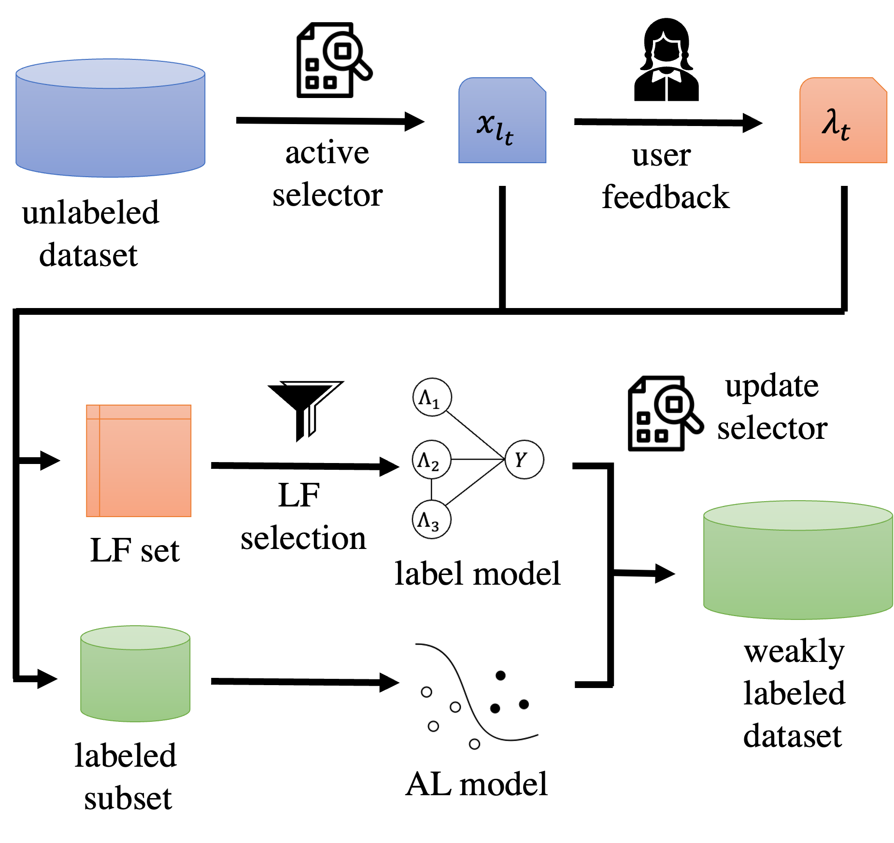

##  ActiveDP: bridging Active Learning with Data Programming


### Description:
The ActiveDP project automatically labels large datasets for training ML models. It combines two different paragidms:
Active Learning and Data Programming, to generate labels with high accuracy and coverage. 



### Installation:
```angular2html
pip install torch torchaudio torchvision
pip install scikit-learn pandas tqdm optuna sentence-transformers snorkel
pip install wandb matplotlib nltk cdt alipy
```
### Usage
```angular2html
python icws.py --dataset Youtube --filter-method Glasso --al-model logistic --use-valid-labels
```
Datasets used for evaluation can be downloaded [here](https://drive.google.com/file/d/1geybAAF1jdL2v396OvL78OyHlsWMTpn3/view?usp=sharing)
